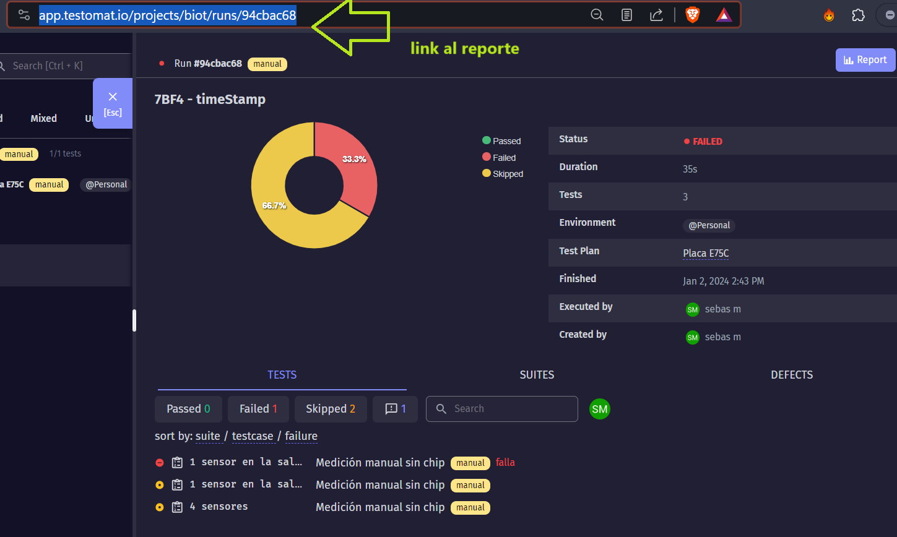
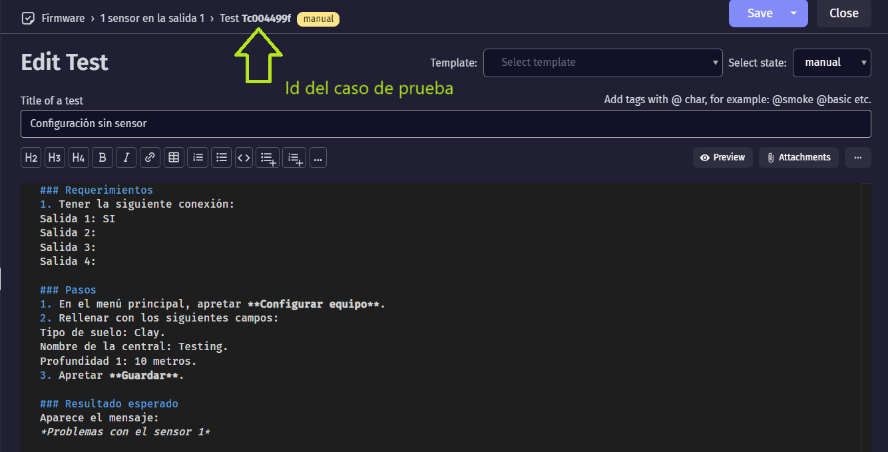

Plan de pruebas
###############

.. sectnum:: 
   :suffix: .-
   :start: 6
   :depth: 3

.. contents::

.. # with overline, for parts
.. * with overline, for chapters
.. = for sections
.. - for subsections
.. ^ for subsubsections
.. " for paragraphs

Introducción
************

Se expone aquí la documentación y herramientas usadas para las pruebas de 
desarrollo. Se especifica el plan de pruebas, los casos de prueba y como se 
debe reportar los resultados (métricas y bugs) que resume los resultados 
obtenidos de la ejecución de los ciclos de pruebas.

El trabajo se ha organizado en cuatro etapas:

- Planificación, 
- Ciclo de prueba, 
- Verificación de bugs y 
- Evaluación del proyecto.

Plan de prueba del proyecto
***************************

Objetivo
========

El objetivo del plan de pruebas es reunir toda la informacion necesaria para 
planificar, gestionar y controlar el esfuerzo de las tareas que involucran 
testear las funcionalidades que mas abajo serán detalladas.

Describe la propuesta de las pruebas del firmware. Es un plan a alto nivel 
generado y usado por los responsables para validar el producto BIOT.

El documento proporciona los siguientes objetivos:

- Identificar las funciones que deben ser probadas y las que no.
- Realizar el tipo de prueba (caso de prueba).
- Especificar las estrategias a usar.
- Identificar los recursos necesarios y el esfuerzo estimado para las pruebas.
- Listar los elementos entregables del proyecto de pruebas.

Alcance
=======

Se enfoca en los requerimientos funcionales y no funcionales de los modulos 
que forman el firmware a verificar. Se detalla a continuacion el tipo de 
prueba a realizarse.

Estrategias de pruebas
======================

Cantidad de Recursos: 2.

- 1 tester al 100%
- 1 tester al 50% tester, 20% Liderazgo) 

Etapas de pruebas:

.. csv-table:: Etapas
    :header: Diseño de casos, Ciclo 1, Ciclo 2, Cierre
    :widths: 10, 10, 10, 10

    Escribir casos de pruebas, Testing funcional, Verificación de bugs, "Métricas, reportes"
    , Registro de bugs, Testing de regresión (opcional), 

- **Diseño de casos de prueba:** se asignan los recursos al analisis y 
  diseño de casos de pruebas basados en los requerimientos aprobados. 
  El tipo de pruebas son funcionales de caja negra.
- **Ciclo 1:** recursos asignados a ejecutar los casos de prueba. 
  También se registran los fallos (bugs) que aparezcan.
- **Ciclo 2:** recursos asignados a:

  - verificar bugs reportados según severidad.
  - Testing de regresión, selectivo. Solo los casos de prueba de prioridad alta.
  - Gestionar defectos.
  - Contestar consultas sobre los defectos reportados tan rápido como sea posible.

- **Cierre:** una vez arreglado los bugs y habiendo cumplido con los criterios de 
  aceptación, se realiza el reporte final y se concluye el testing.

Prioridades de los casos de pruebas
===================================

Se definen dos (2) niveles de prioridad:

- Prioridad 1 (alta): los casos que se consideran importantes para la experiencia 
  de usuario.
- Prioridad 2 (baja): designado para el resto de los casos

Disponibilidad de recursos
==========================

Se cuentan con 4 recursos:

- 1 tester asignados al 100%. Donde 100% equivale a 3 hs. por dia productivo.
- 1 tester asignados al 50%.
- 1 líder de proyecto asignado al 20% a tareas de liderazgo.
- 1 desarrollador asignado al 100% a tareas de verificación de bugs y lectura de reportes .
- Se cuentan con cinco dias a la semana, sin feriados.
- No se requieren de capacitaciones previas.

El equipo está conformado por:

.. csv-table:: Equipo
    :header: Rol, Nombre, Tarea
    :widths: 10, 10, 10

    Líder de proyecto, Guillermo o Fernando, Supervisador de avance del proyecto
    Desarrollador, Sebas, Confección plan de pruebas y supervisión de bugs
    Testers, Luis y Martín, Ejecucuión de plan de pruebas y confección de reporte de bugs

Proceso empleado
================

Registros de prueba
-------------------

Tanto para escribir, ejecutar y registrar los resultados de los casos de pruebas 
se usa la herramienta online Testomat.io. El estado de cada caso de prueba son: 
por hacer, pasó, falló, no aplica.

Para ejecutar un nuevo conjunto de pruebas, se debe ir a la sección "Runs" de 
Testomat, hacer click en "Manual Run".

En el campo "Title (optional)" usar el siguiente título:

    .. code-block:: console

        <Versión de firmware> - <Proveedor de internet> - <Versión de la app>

En el campo "Set enviroment for execution" elegir el nombre de la placa, las 
cuales ya deberían estar pre cargadas.

Luego hacer click en "Launch" para ejecutar el conjunto de pruebas, hacerlo y 
finalizarlo. Cuando se acabe, el reporte quedará registrado en la misma herramienta,
que se puede descargar en formato ".xlsx" si es requerido.

Para mantener al tanto al resto del equipo, el tester debe copiar el link del registro 
de pruebas, tal como se ve en la siguiente imagen:

y pegarlo en el siguiente documento de Google.docs: `Registro de pruebas 
  <https://docs.google.com/document/d/1BDQWDhOfA1EpYbVgoTN1ycC1H1rvaq6A6ADwkQKxt4M/edit>`_.

Reporte de bugs
---------------

En caso de que se genere un bugs, poner en dicho caso de prueba "FAILED" y luego 
usar las etiquetas "falla crítica" o "falla" y escribir una breve descripción 
del bugs. En caso de ser necesario, se pueden subir archivos para una mejor 
descripción.

Ambiente de prueba
==================

Cada tester debe contar con:

- Versión de firmware instalada en la placa a testear.
- Celular con app BIOT instalada, y conectada a la placa.
- Notebook con el software Insomnia para hacer peticiones http a la placa.
- Acceso al proyecto BIOT en la cuenta de Testomat.io.  
- Chip con datos activados en el módulo SIM.
- Memoria SD colocada en el módulo de memoria de la placa.

Criterio de suspensión
======================

En caso de encontrar un bug o defecto que impacte en el progreso de las tareas
planificadas el lider de testing puede suspender las pruebas usando los 
siguientes criterior:

- No se cuenta con los requerimientos mencionados antes al momento del testing.
- El éxito en un caso de prueba es condición para los siguientes. Ejemplo: 
  no se pueden realizar mediciones manuales si no se logró configurar el equipo.

Casos de prueba
===============

La herramienta Testomat puede crear casos de prueba fácilmente y lucen como 
en la imagen:

Cronograma de entregables
=========================

.. list-table:: 
   :widths: 15 10 30 30 20
   :header-rows: 1

   * - Entregable
     - Asignado
     - Fecha de inicio
     - Fecha de entrega
     - Responsable de recepción
   * - Diseño de plan de pruebas
     - Desarrollador
     - 29 de diciembre de 2023 
     - 2 de enero de 2024
     - Testers
   * - Ejecución de ciclo 1
     - Testers
     - <insertar fecha>
     - <insertar fecha>
     - Desarrollador
   * - Ejecución de ciclo 2
     - Testers
     - <insertar fecha>
     - <insertar fecha>
     - Desarrollador
   * - Cierre
     - Desarrollador
     - <insertar fecha>
     - <insertar fecha>
     - Líder de proyecto

Especificación de casos de pruebas
==================================

Los casos de prueba se enlistan en 3 subgrupos o módulos:

- 1 salida
- Palabras clave
- Mediciones automáticas

1 salida 
--------

- **Descripción:** detalla las pruebas que se pueden realizar cuando un solo sensor se conecta a una sola salida.
- **Posibles agregados:**
  - Varias salidas.
  - Las 5 salidas conectadas.
  - Medición en modo offline y/o sin chip.
  - Pedido de historial cuando no hay datos en la SD.
  - Configuración en modo offline.

.. list-table:: 
   :widths: 15 10 30 30
   :header-rows: 1

   * - Id
     - Nombre
     - Descripción
     - Resultado esperado
   * - @T2c711d2f 
     - Configuración del RTC 
     - Setear la hora del RTC externo (DS3231). 
     - Setea la hora del RTC externo (DS3231) y devuelve la versión del firmware.
   * - @T68ad08c3 
     - Configuración con otro tipo de sensor
     - Se configura el equipo con un sensor cuyo tipo no coincide con el tipo de sensor conectado
     - La respuesta  debe indicar falla en la respectiva salida, que no se guardó y que no se envió.
   * - @T0ed703f7
     - Configuración sin sensor
     - Se configura un sensor cuando en la placa no hay ningún sensor conectado
     - La respuesta  debe indicar falla en la respectiva salida, que no se guardó y que no se envió.
   * - @Tb42fd51a
     - Configuración sin chip
     - Se configura sin chip en el módulo SIM808
     - El equipo debe guardar la configuración pero indicar que falló el envío al servidor.
   * - @Tdf0541fb
     - Configuración normal
     - Se configura normalmente
     - El equipo debe indicar que la configuración se guardó y que se envió al servidor
   * - @T72b2024f
     - Medición manual
     - Se pide al equipo que haga una medición manual en el momento
     - El equipo debe medir y enviar el resultado al servidor y a la app.
   * - @Tb036b6ce
     - Pedido de historial
     - Se pide el historial de mediciones no enviadas guardadas en la SD
     - El equipo debe devolver el historial en el formato correcto.

Palabras clave
--------------

- **Descripción:** detalla las pruebas para las palabras clave; no es necesario conectar ningún sensor.

.. list-table:: 
   :widths: 15 10 30 30
   :header-rows: 1

   * - Id
     - Nombre
     - Descripción
     - Resultado esperado
   * - @Tbf5d2cbc
     - erase
     - Borra la configuración del equipo.
     - Mensaje de que se ha borrado la configuración.
   * - @T9f9e0457
     - eeprom
     - Pide la configuración.
     - Muestra la configuración que tiene el equipo en ese momento.
   * - @T9a7191c4
     - chequeo
     - Pide chequear los módulos SIM, RTC y SD; y también chequea el estado de la comunicación con los sensores.
     - Muestra el estado los módulos y sensores
   * - @Tf6811e5d
     - voltaje
     - Setear el coeficiente de voltaje.
     - Mensaje avisando que se seteó el coeficiente de voltaje y su valor.
   * - @T393988ac
     - modo12
     - Des/activar el modo 12
     - Mostrar el estado actual del modo 12.
   * - @T50ac382e
     - offline
     - Des/activar el modo offline
     - Mostrar el estado del modo offline
   * - @T633f43bb
     - modulo
     - Borrar la tarjeta SD
     - Mostrar un mensaje que siga que se borraron las mediciones no enviadas  guardadas en la SD. 
   * - @T4750ac82
     - reset
     - Resetear el equipo
     - Avisar que se va a apagar y volver a encender el equipo automáticamente en X segundos.
   * - @T9765f1a7
     - apn
     - Setear el APN de forma manual
     - Informar las credenciales que se van a usar
   * - @T5d032083
     - user
     - Ídem para el USER
     - Informar las credenciales que se van a usar
   * - @Tfd33ca75
     - pwd
     - Ídem para el PWD
     - Informar las credenciales que se van a usar
   * - @T7a82f772
     - erase cred
     - Borrar las credenciales
     - Informar que se borraron las credenciales

Mediciones automáticas
----------------------

- **Descripción:** detalla las pruebas para que el equipo se deje x cantidad de días tomando mediciones de forma automática.

.. list-table:: 
   :widths: 15 10 30 30
   :header-rows: 1

   * - Id
     - Nombre
     - Descripción
     - Resultado esperado
   * - T25fe5f7e
     - {offline; modo12} = {Sí, Sí}
     - Se deja el equipo funcionando con el modo offline ACTIVADO y el modo12 ACTIVADO.
     - Se deben haber quedado guardadas las mediciones en la SD con el timeStamp cada 1 hora.
   * - Td0787d31
     - {offline; modo12} = {Sí, -}
     - Se deja el equipo funcionando con el modo offline ACTIVADO y el modo12 desactivado.
     - Se deben haber quedado guardadas las mediciones en la SD con el timeStamp cada 12 horas.
   * - Tdd8bbeac
     - {offline; modo12} = {-, Sí}
     - Se deja el equipo funcionando con el modo offline desactivado y el modo12 ACTIVADO.
     - No deben haber mediciones en la SD y las mediciones en el servidor deben ser cada 1 hora.
   * - T8774af73
     - {offline; modo12} = {-, -}
     - Se deja el equipo funcionando con el modo offline desactivado y el modo12 desactivado.
     - No deben haber mediciones en la SD y las mediciones en el servidor deben ser cada 12 horas.

Mediciones de autonomía 
***********************

En esta sección se detalla una serie de pruebas para medir la 
autonomía de la batería de los equipos BIOT.

.. warning:: 
    
    No forma parte de los testing, esos se hacen para corroborar 
    o validar el comportamiento que ya se verificó en el desarrollo, 
    y estas pruebas son para medir cuánto duran las baterías que 
    alimentan al equipo.

