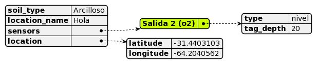

Versionado
##########

- Todos los cambios notables en este proyecto van a ser documentados aquí. 
- Las entradas más recientes se colocan arriba.
- Este proyecto adhiere a `Semantic Versioning 
  <https://semver.org/spec/v2.0.0.html>`_.

Nomenclatura
************

.. raw:: html

   

      V&lt;major&gt;&lt;minor&gt;&lt;patch&gt;
   

- ``Major``: se incrementa cuando se hacen cambios incompatibles con versiones anteriores.
- ``Minor``: se incrementa cuando se agregan nuevas funcionalidades de forma compatible con versiones anteriores.
- ``Patch``: se incrementa cuando se realizan correcciones de errores o cambios menores de forma compatible con versiones anteriores.

Tipos de cambios
****************

- ``Added`` para funcionalidades nuevas.
- ``Changed`` para los cambios en las funcionalidades existentes.
- ``Removed`` para las características en desuso que se eliminaron en esta versión.
- ``Fixed`` para corrección de errores.

Versión 7
*********

V7.4.3 - 21/11/2023
===================

Added
-----

- **Valores relacionados al timeStamp en response de 
  configuración:** se agregan los siguientes campos al 
  ``http_response`` de configuración.
  
  .. code-block:: console

    "unix_eeprom": "2023-11-21-12-00-00",
    "timeStamp RTC externo": "2023-11-21-12-55-41",
    "timestamp equipo": "2023-11-21-12-55-41",

- **Valores relacionados al timeStamp en response:** se agregan los siguientes 
  campos al ``http_response`` de configuración.
  
  .. code-block:: console

    "unix_eeprom": "2023-11-21-12-00-00",
    "timeStamp RTC externo": "2023-11-21-12-55-41",
    "timestamp equipo": "2023-11-21-12-55-41",

V7.4.2 - 14/11/2023
===================

Fixed
-----

- **Valores no válidos de parámetros:** la trama que devolvía el sensor ph 
  no era válida, no comenzaba con 0x01 0x03. Corregido, ahora se pide la trama
  hasta que responda de esa forma. 

V7.4.1 - 13/11/2023
===================

Changed
-------

- **Tiempo de espera del wifi:** cuando el equipo se enciende por interrupción,
  se queda despierto durante 5 minutos. Si cuando queda menos de 1 minuto se 
  realiza una petición, entonces se agrega 1 minuto más al tiempo en el que 
  el wifi está activo. 

Added
-----

- **Campo de timeStamp en la configuración y en la medición manual**: se agrega
  un campo de timestamp en el json de configuración en la ``http_response`` 
  cuando se configura un equipo y cuando se pide medición manual. Esto se hace 
  para saber si al momento de hacer la petición un problema con el rtc. 
  El ``http_response`` de configuración pasa a ser:

    .. code-block:: http
        :emphasize-lines: 7

        HTTP/1.1 200 OK
        Content-Type:text/plain;charset=UTF-8

        {
           "id": "L-33F8",
           "offline": true,
           "timestamp": "2023-11-13-16-57-47",
           "sensors": {
             "1": true,
             "2": false,
             "3": false,
             "4": false,
             "5": false
           },
           "save": true,
           "connection": false,
           "server": false
        }

  y el de medición manual:

    .. code-block:: http
        :emphasize-lines: 6

        HTTP/1.1 200 OK
        Content-Type:text/plain;charset=UTF-8

        {
          "offline": true,
          "timestamp": "2023-11-13-17-19-02",
          "sensors": {
            "1": {
              "status": true,
              "T": "26.23",
              "H": "12.84",
              "E": 172,
              "N": 7,
              "P": 26,
              "K": 30,
              "sent": false,
              "save": true
            }
          },
          "sent_from_sd": 0,
          "rest_on_sd": 34
        }

  donde las líneas resaltadas son las agregadas.     

V7.4.0 - 07/11/2023
===================

Added
-----

- **Sensor PH:** se agrega la funcionalidad para configurar y medir con 
  un sensor typo PH. El ``json_measure`` pasa de ser: 

  .. code-block:: json

    {
       "enabled": true,
       "id": "L-D944",
       "product": "THSST",
       "timestamp": "2023-11-12-16-55-49",
       "location": {
         "latitude": -31.44026566,
         "longitude": -64.20396423
       },
       "value": {
         "sn": "00000000001",
         "humidity": 100,
         "temperature": 23.56,
         "location_name": "holas",
         "tag_depth": 10,
         "loss_tangent": 0.000,
         "electrical_conductivity": 325,
         "electrical_conductivity_tc": 8,
         "real_dielectric_permittivity": 45,
         "real_dielectric_permittivity_tc": 53,
         "imag_dielectric_permittivity": 0,
         "imag_dielectric_permittivity_tc": 0,
         "level_bat": 12.90000029
       },
       "verFirm": "V7.4.0",
       "verHard": "V1.1.0",
       "number_sent": 0
    }

  a ser: 
  
  .. code-block:: json
    :emphasize-lines: 23

    {
       "enabled": true,
       "id": "L-D944",
       "product": "THSST",
       "timestamp": "2023-11-12-16-55-49",
       "location": {
         "latitude": -31.44026566,
         "longitude": -64.20396423
       },
       "value": {
         "sn": "00000000001",
         "humidity": 100,
         "temperature": 23.56,
         "location_name": "holas",
         "tag_depth": 10,
         "loss_tangent": 0.000,
         "electrical_conductivity": 325,
         "electrical_conductivity_tc": 8,
         "real_dielectric_permittivity": 45,
         "real_dielectric_permittivity_tc": 53,
         "imag_dielectric_permittivity": 0,
         "imag_dielectric_permittivity_tc": 0,
         "ph": 7.68,
         "level_bat": 12.90000029
       },
       "verFirm": "V7.4.0",
       "verHard": "V1.1.0",
       "number_sent": 0
    }  

Removed
-------

- **Valor nulo válido:** si el sensor responde una trama válida, pero 
  con valores nulos, entonces la respuesta no es ``false``, sino ``true``.

V7.3.2 - 20/10/2023
===================

Fixed
-----

- **Salida 5:** problemas con la habilitación de la salida 5.
  Corregido: no se había definido el pin 27 como salida, faltaban las
  siguientes líneas:

  .. code-block:: console

    pinMode(SENSOR_5_POWER_PIN, OUTPUT);
    digitalWrite(SENSOR_5_POWER_PIN, LOW);

V7.3.1 - 19/10/2023
===================

Added
-----

- **Salida 5:** se habilita la salida 5 en la placa. 

V7.3.0 - 18/10/2023
===================

Added
-----

- **Pines de la placa versión 1.2:** se agrega cambio para que 
  mediante la definición de una constante, se pueda elegir la 
  asignación de pines dependiendo la versión de la placa. 
  
  Cambió en la asignación de pines de la comunicación con el módulo sim: 
  
  .. code-block:: console

    SIM800_TX_PIN = GPIO_NUM_4  (antes)
    SIM800_RX_PIN = GPIO_NUM_2  (antes)

    SIM800_TX_PIN = GPIO_NUM_2  (ahora)
    SIM800_RX_PIN = GPIO_NUM_4  (ahora)
  
  Eliminación del pin que alimenta el módulo sim. * 

  .. code-block:: console

    SIM800_POWER_PIN = GPIO_NUM_14  (antes)
    // SIM800_POWER_PIN = ---       (ahora)

  Cambio en el pin que alimenta a los módulos. **

  .. code-block:: console
  
    MODULES_POWER_PIN = GPIO_NUM_27 (antes)
    MODULES_POWER_PIN = GPIO_NUM_14 (ahora)

  Se habilita la salida 5: 

  .. code-block:: console
  
    // SENSOR_5_POWER_PIN = ---         (antes)
    SENSOR_5_POWER_PIN = GPIO_NUM_27    (ahora)
  
  .. note::
    
    \* Los cambios en estos pines se debe a una equivocación a la hora 
    de asignar dichos pines en el diseño de la placa.
    
    \*\* El módulo sim queda ahora alimentado cuando se alimentan 
    los módulos.

V7.2.1 - 9/10/2023
==================

Fixed
-----

- **Campo "loss tangent" a 3 decimales::** el campo correspondiente al 
  valor del sensor de nivel se restringe a 3 decimales. 

V7.2.0 - 8/10/2023
==================

Fixed
-----

- **Problemas lectura desde "register.txt":** cuando se accedía 
  al archivo "register.txt" quedaba en buble y nunca salía. 

V7.1.4 - 4/10/2023
==================

Fixed
-----

- **Problemas el campo "level_bat":** el campo ``level_bat`` del 
  ``json_measure`` no contenía decimales.

V7.1.2 - 2/10/2023
===================

Fixed
-----

- **Problemas con la palabra clave "chequeo":** el equipo devolvía un 
  chequeo de sensores erróneo, siempre chequeaba la misma salida, 
  independientemente de lo que decía la configuración. Se cambió: 
  
  .. code-block:: c++
     
    for (size_t i = 0; i < 4; i++) {
      if (config.tag_depth[i] > 0)
        sensors[String(i + 1)] = Sensor1::check_sensor_in_a_out(0, config.type[0]);
    }

  por: 
     
  .. code-block:: c++
    
    for (size_t i = 0; i < 4; i++) {
      if (config.tag_depth[i] > 0)
        sensors[String(i + 1)] = Sensor1::check_sensor_in_a_out(i, config.type[i]);
    }

Added
-----

- **Palabra clave "erase log":** recrea el archivo ``/activity.txt``. 

V7.1.1 - 1/10/2023
===================

Fixed
-----

- **Problemas con float al serializar json:** cuando una variable float se 
  serializaba en el json, pasaba de ser
  
  .. code-block:: console

    "temp": 12.36

  a ser 

  .. code-block:: console

    "temp": 12.35999999

  Se corrigió pasando de tipo de variable ``float`` a ``double``.

V7.0.1 - 29/09/2023
===================

Changed
-------

- **http de palabras clave de credenciales:** las respuestas del equipo a la app se 
  cuando se cambia de credenciales cambiaron a formato json.

V7.0.0 - 29/09/2023
===================

Changed
-------

- **http en formato json:** las respuestas del equipo a la app se 
  cambiaron a formato json.

Versión 6
*********

V6.2.1 - 22/09/2023
===================

Fixed
-----

- **Respuestas no solicitadas del sim:** el módulo sim responde con los 
  siguientes códigos no solicitados después de que se lo alimentase: 
  ``Call Ready`` y ``SMS Ready``. Se modificó el firmware para que se siga 
  esperando la respuesta si alguno de estos códigos aparece.

- **Configuración de modo12:** pasos a seguir antes: 
  - Configurar sensores.
  - Des/activar modo 12 con palabra clave.
  - Salir y volver a entrar al menú de configuración para actualizar el tiempo unix guardado en la eeprom.

  Pasos a seguir ahora:
  - Configurar sensores.
  - Des/activar modo 12 con palabra clave.

Added
-----

- **Tiempo agregado al wifi:** el wifi se enciende por interrupción por 5 
  minutos y cada vez que se realiza una de las 4 peticiones válidas, se van 
  a agregar 2 minutos mas. 
  
  .. note:: 

    Recordar que con la palabra clave ``reset`` el esp32 se resetea y se 
    pone a dormir.

Fixed
-----

- **Palabra clave "log":** la palabra clave "log" devolvía un archivo que 
  se cortaba cuando encontraba un String nulo, cosa que no se debía hacer 
  porque el archivo log no se acaba ahí. Para arreglarlo, se pregunta si 
  la posición del cursor es igual al tamaño del archivo.

V6.2.0 - 20/09/2023
===================

Added
-----

- **Credenciales ingresadas:** se agregan palabras clave para ingresar desde 
  la app APN, USER y PWD si se desea que el equipo use unas credenciales en 
  particular en lugar de consultar por la empresa proveedora de servicio para 
  cargar las que están en el firmware por defecto.

V6.1.0 - 13/09/2023
===================

Changed
-------

- **unix time de config:** cada vez que el equipo se despierta por timer y 
  falla la inicialización del ds3231, el rtc interno se setea con el 
  valor del unix de la última vez que se configuró el equipo más una 
  cantidad de segundos que es igual al intervalo de medición 
  multiplicado por el número de veces que el equipo se despertó por 
  timer.
  
  Por ejemplo, si el equipo está en modo 12 y se configuró a la 17:30,
  entonces el tiempo unix de referencia se situa a la 17:00 y un 
  contador interno en 0. Entonces, si el equipo se despierta a la 
  19:00 y el ds3231 no se inicializó, el rtc se sitúa en ``unix + 
  cont · Δ12``.

  .. image:: images/changelog-v6.2.0_02.png

  Si el equipo está configurado en modo normal, entonces el tiempo unix 
  de referencia se situa a la 12:00. Si el equipo se despierta 24 hs 
  después, entonces el rtc se sitúa en 

  Así, suponiendo que la inicialización del ds3231 falló y el equipo 
  se configuró a la 17:30, el tiempo unix de referencia (si el modo 
  12 está activado) va a ser la 17:00; y si el equipo ``unix + 
  cont · Δn``.

  .. image:: images/changelog-v6.2.0_01.png

  .. warning:: 

    Para que el equipo se setee bien, hay que seguir estos pasos:

    1. Configurar el equipo normalmente.
    2. Usar la palabra clave "modo12" 1 o 2 veces para des/activar el 
       modo 12.
    3. Salir del menú "Configuración" y volver a entrar para que se 
       configure bien el tiempo unix de referencia.

V6.0.2 - 12/09/2023
===================

Fixed
-----

- **Envío duplicado:** cuando se enviaba por un json con un timestamp 
  futuro, se corregía pero el json corregido se enviaba 2 veces.

V6.0.1 - 10/09/2023
===================

Fixed
-----

- **Seteado de Rtc interno y externo:** había problemas con el
  seteado del rtc interno y del ds3231 a parti del tiempo unix.

V6.0.0 - 08/09/2023
===================

Changed
-------

- **Medición de nivel promediado:** la medición de un sensor de
  nivel antes era:

  1. Se alimenta sensor
  2. Se espera 14 segundos
  3. Se toma una medición
  4. Se desalimenta el sensor
  5. Se procesa la respuesta y se obtiene el valor del nivel medido

  Ahora se hace:

  1. Se alimenta sensor
  2. Se toma una medición
  3. Se procesa la respuesta y se obtiene el valor del nivel medido
  4. Se espera 1 segundo
  5. Se repite los 30 veces 3 pasos anteriores (2 al 4)
  6. Se desalimenta el sensor
  7. Se promedia los 30 valores de nivel y no se tiene en cuenta
     las mediciones en 0 ni las que se alejen demasiado del 
     promedio de las dos últimas mediciones.

Versión 5
*********

V5.3.0 - 08/09/2023
===================

Changed
-------

- **Apn de Movistar:** antes era:

  .. code-block:: console

    apn:    wap.gprs.unifon.com.ar
    user:   wap
    pwd:    wap

  y ahora es:

  .. code-block:: console

    apn:    gm2m.movistar
    user:   gm2m
    pwd:    gm2m

V5.2.2 - 07/09/2023
===================

Fixed
-----

- **Comunicación con la app:** se arreglaron algunos fallas con la 
  comunicación con la app. 

Added
-----

- **Palabra clave "reset":** resetea el esp32, al igual que apretar 
  el botón EN en la placa de desaroollo. Esto se hace debido a que 
  a veces el equipo muestra comportamientos no esperados.

  .. warning:: 

    Al hacer esto, la red wifi se apaga y se la tiene que volver a 
    generar con el pulsador magnético.

V5.2.1 - 30/08/2023
===================

Changed
-------

- **Palabra clave "chequeo":** se agrega información de los 
  modos 12 y offline y del número de mediciones guardadas.

  .. code-block:: http
    :emphasize-lines: 13-15

    HTTP/1.1 200 OK
    Content-Type:text/plain;charset=UTF-8

    Chequeo:
    ========
    - Tarjeta SD: ok
    - Reloj externo: ok
    - Salidas:
     · 1) ok
     · 2) No configurado
     · 3) No configurado
     · 4) No configurado
    - Modo 12: No
    - Modo offline: Sí
    - Mediciones guardadas: 3

  En donde las últimas líneas resaltadas son las agregadas.

V5.2.1 - 29/08/2023
===================

Changed
-------

- **Respuesta de configuración ok:** cuando la configuración 
  se hace bien, se guarda y se envía, se responde a la app el 
  siguiente http_response:

  .. code-block:: bash

      HTTP/1.1 200 OK
      Content-Type:text/plain;charset=UTF-8

      Equipo configurado 
      ==================
      1: 10.00 metros (the)
      2: No configurado
      3: No configurado
      4: No configurado

- **Respuesta de configuración con json mal formado:** cuando 
  la app manda un json mal formado, la http response es:

  .. code-block:: bash

      HTTP/1.1 200 OK
      Content-Type:text/plain;charset=UTF-8

      Json inválido

- **Respuesta de configuración con modo offline:** si el 
  equipo está con el modo offline activo y la app envía una 
  petición para hacer una configuración, ésta se hace pero no 
  se envía; la http response es:

  .. code-block:: http

      HTTP/1.1 200 OK
      Content-Type:text/plain;charset=UTF-8

      Modo offline activo. Configuración hecha, pero no enviada
      Equipo configurado 
      ==================
      1: 10.00 metros (the)
      2: No configurado
      3: No configurado
      4: No configurado

- **Respuesta de configuración con problemas de conexión:** si 
  el equipo recibe una petición para configurarlo y hay 
  problemas de conexión, el chip está mal colocado o no tiene 
  datos activados, la configuración se hace pero no se envía. 
  La http response es:

  .. code-block:: http

      HTTP/1.1 200 OK
      Content-Type:text/plain;charset=UTF-8

      Problemas de conexión. Chip mal colocado o sin datos.
      Configuración hecha, pero no enviada
      Equipo configurado 
      ==================
      1: 10.00 metros (the)
      2: No configurado
      3: No configurado
      4: No configurado

- **Respuesta de configuración con problemas del servidor:** si 
  el equipo recibe una petición para configurarlo y se logra 
  conectar a internet pero no al servidor, la configuración se 
  hace pero no se envía. La http response es:

  .. code-block:: http

      HTTP/1.1 200 OK
      Content-Type:text/plain;charset=UTF-8

      Problemas de servidor. Configuración hecha, pero no enviada
      Equipo configurado 
      ==================
      1: 10.00 metros (the)
      2: No configurado
      3: No configurado
      4: No configurado

- **Respuesta a palabra clave "modo12":** al usar la palabra 
  clave "modo 12", se des/activa el modo 12, y el http response 
  depende de si el modo 12 está activado o no.
  Si está activado, es:

  .. code-block:: http

      HTTP/1.1 200 OK
      Content-Type:text/plain;charset=UTF-8

      Modo 12:
       · Medición cada 1 hs
       · Envío cada 12 hs
       · Envíos a la 00:00 y 12:00 hs

  Si está desactivado, es:

  .. code-block:: http

      HTTP/1.1 200 OK
      Content-Type:text/plain;charset=UTF-8

      Modo normal:
       · Medición cada 24 hs
       · Envío cada 24 hs
       · Envíos a la 12:00 hs
  
- **Respuesta a palabra clave "offline":** al usar la palabra 
  clave "offline", se des/activa el modo offline, y el http 
  response depende de si el modo offline está activado o no.
  Si está activado, es:

  .. code-block:: http

      HTTP/1.1 200 OK
      Content-Type:text/plain;charset=UTF-8

      Modo offline: las mediciones NO se envían, sólo se guardan

  Si está desactivado, es:

  .. code-block:: http

      HTTP/1.1 200 OK
      Content-Type:text/plain;charset=UTF-8

      Modo online: las mediciones se envían normalmente

- **Respuesta a configuración con problemas de sensor:** si el 
  equipo recibe una petición de configuración, pero hay 
  problemas con un sensor en una salida, no se toca la 
  configuración anterior y el http response es:

  .. code-block:: http

      HTTP/1.1 200 OK
      Content-Type:text/plain;charset=UTF-8

      Problemas con la salida 1. Revise conexión

  .. warning:: 
      
      Cuando se detecta problemas en una salida, se interrumpe 
      la configuración y no se sigue con la siguiente. Por 
      ejemplo, si se quiere configurar sensores en las salidas 
      1 y 2 y ambos están descoenctados, entonces se muestra el 
      mensaje anterior, pero no hay forma de saber el estado 
      de la salida 2. Por eso hay que corregir el el problema 
      en la salida 1 e intentar configurar de nuevo para saber 
      si el sensor en la salida 2 responde bien. 

- **Respuesta a palabra clave "erase":** se borra la 
  la configuración y http response es:

  .. code-block:: http

      HTTP/1.1 200 OK
      Content-Type:text/plain;charset=UTF-8

      La configuración ha sido borrada

- **Respuesta a palabra clave "eeprom":** devuelve el json de 
  configuración que se arma para enviar al servidor.

  .. code-block:: http

      HTTP/1.1 200 OK
      Content-Type:text/plain;charset=UTF-8

      {
        "id": "L-7BF4",
        "product": "THSST",
        "soil_type": "Arcilloso",
        "location_name": "holas",
        "location": {
            "latitude": -31.44030952,
            "longitude": -64.20405579
        },
        "sensors": {
            "00000000001": {
            "type": "the",
            "tag_depth": "10.00"
            }
        }
      }

- **Respuesta a palabra clave "chequeo":** chequea el estado del
  equipo y devuelve el resultado:

  .. code-block:: http

      HTTP/1.1 200 OK
      Content-Type:text/plain;charset=UTF-8

      Chequeo:
      ========
      - Tarjeta SD: ok
      - Reloj externo: ok
      - Salidas:
        · 1) ok
        · 2) No configurado
        · 3) No configurado
        · 4) No configurado

- **Respuesta a palabra clave "regall":** devuelve el archivo 
  "regall.txt":

  .. code-block:: http

      HTTP/1.1 200 OK
      Content-Type:text/plain;charset=UTF-8

      [
        {json_measure_0}
        ,{json_measure_1}
        ,{json_measure_2}
        ,...
        ,{json_measure_n}
      ]

- **Respuesta a palabra clave "voltaje,":** setea el coeficiente
  de voltaje y devuelve:

  .. code-block:: http

      HTTP/1.1 200 OK
      Content-Type:text/plain;charset=UTF-8

      Coeficiente de voltaje seteado en 1.02

V5.2.0 - 28/08/2023
===================

Added
-----

- **Funcionalidad para guardar registro:** se guarda registro 
  en la memoria SD para las peticiones updateDate y setConfig.

V5.1.0 - 24/08/2023
===================

Added
-----

- **Respuesta a la palabra clave "modulo":** se elimina y se 
  recrea el archivo "register.txt", que es en donde se guardan
  las mediciones no enviadas. La HTTP response es:

.. code-block:: c

    HTTP/1.1 200 OK
    Content-Type:text/plain;charset=UTF-8

    Memoria SD formateada

- **Respuesta a configuración en offline:** cuando el equipo está 
  en modo offline y la app manda la petición para configurarlo, 
  la configuración se hace pero no se envía el metadata al 
  servidor. La HTTP response es:

.. code-block:: c

    HTTP/1.1 200 OK
    Content-Type:text/plain;charset=UTF-8

    Configuración hecha pero no enviada, el equipo está 
    en modo offline

V5.0.1 - 30/06/2023
===================

Fixed
-----

- **Respuesta al modo12**: se cambia el mensaje cuando el modo12 está 
  activado. Pasa de ser:

.. code-block:: console

   "Modo Ledesma: se mide cada 1..."
   
a ser:

.. code-block:: console

   "Modo 12: se mide cada 1..."

Added
_____

- Se muestra tipo de sensor en respuesta a "eeprom": cuando se 
  responde a la palabra clave "eeprom", ahora se muestra el 
  tipo de sensor, y si es de tipo "nivel", se muestran metros 
  en lugar de cm. La respuesta pasa de ser:

.. code-block:: console

   O2) 12.00 cm
   O3) 2.00 cm

a ser:

.. code-block:: console
   
   O2) 14.00 cm (the)
   O3) 2.00 m (nivel)

V5.0.0 - 29/06/2023
===================

Changed
-------

- **Json que la app manda al equipo**: se cambia el json que la app le 
  manda al equipo para configurarlo. En particular, se eliminan los 
  espacios en el nombre del siguiente campo:

.. code-block:: console

   "Salida 1 (o1)": 100,

ahora es:

.. code-block:: console

   "Salida1(o1)": 100,

El json entonces pasa de ser:

.. code-block:: json

   {
      "soil_type": "Arcilloso",
      "location_name": "Hola",
      "sensors": {
         "Salida 2 (o2)": {
            "type": "nivel",
            "tag_depth": 20
         }
      },
      "location": {
      "latitude": -31.4403103,
      "longitude": -64.2040562
      }
   }

a ser:

.. code-block:: json

   {
      "soil_type": "Arcilloso",
      "location_name": "Hola",
      "sensors": {
         "Salida2(o2)": {
            "type": "nivel",
            "tag_depth": 20
         }
      },
      "location": {
      "latitude": -31.4403103,
      "longitude": -64.2040562
      }
   }

El siguiente gráfico muestra resaltado el campo modificado.

.. image:: images/changelog-01.png

Added
-----

- **Documentación "modo12" y "modooffline"**: faltaba documentar lo que 
  significaban estos modos.

.. csv-table:: Modos 12 y offline
   :header: Modo, Intervalo de medición (hs), Intervalo de envío (hs), Hora de envío
   :widths: 10, 10, 10, 10

   12, 1, 12, 0:00 y 12:00
   Normal, 24, 24, 12:00

.. note:: 
   Cuando el modo offline está activo, el equipo no enciende el módulo SIM808 para enviar datos, así que solamente los guarda en la memoria SD.

Versión 4
*********

V4.2.2 - 27/06/2023
===================
Fixed
-----
- **Modo12 y modooffline**: había un problema en la declaración de una variable que no permitía que las variables booleanas relacionadas a esos modos se guardaran de forma correcta. Corregido.

V4.2.1 - 27/06/2023
===================
Fixed
-----
- **Modo ledesma**: había errores en el enviado de las mediciones.

V4.2.0 - 27/06/2023
===================
Added
-----
- **Modo offline**: se agrega la palabra clave "offline", para decirle al equipo que no hay cobertura así no enciende el módulo sim después de realizar la medición.

.. note:: 
   Cada vez que se agrega un campo a la estructura de la eeprom, se deben seguir los siguientes pasos:
    - Agregar escritura en la función Eeprom1::setStruct
    - Agregar escritura en la función Eeprom1::erase_nvs
    - Agregar lectura en la función Eeprom1::getStruct
    - Descomentar la función Eeprom1::erase_nvs después de inicializar el espacio nvs en la función Eeprom1::setup()
    - Comentar la función Eeprom1::erase_nvs después de inicializar el espacio nvs en la función Eeprom1::setup()

V4.1.6 - 23/06/2023
===================
Fixed
-----
- **Modo12 corregido**: cuando la app mandaba la palabra clave "modo12", 
  no se guardaba bien el valor booleano en la eeprom. Corregido.

V4.1.5 - 23/06/2023
======================
Added
-----
- Se responde firm vers a la app: cuando se abre la app, además de poner 
  en hora al rtc externo, el equipo le responde con la versión de 
  firmware. Antes se respondía:

.. code-block:: http

   HTTP/1.1 200 OK
   Content-Type:text/plain;charset=UTF-8

y ahora se responde:

.. code-block:: console

   HTTP/1.1 200 OK
   Content-Type:text/plain;charset=UTF-8
   
   V4.1.5

V4.1.4 - 23/06/2023
===================
Changed
-------
- Cambio de palabra clave: se cambió la palabra clave "ledesma12" por 
  "modo12", para que no exista ninguna referencia al nombre de ninguna 
  empresa.

V4.1.3 - 23/06/2023
===================
Fixed
-----
- **Apagado de sensor si no se puede chequear**: cuando se configura 
  un sensor y éste no responde después de un determinado intento, la 
  salida no se deshabilitaba y el sensor quedaba alimentado. Corregido.

V4.1.2 - 22/06/2023
===================
Fixed
-----
- **Guardado de modo ledesma**: había problemas cuando se mandaba la 
  palabra clave "ledesma12", no se guardaba correctamente. Corregido.

V4.1.1 - 22/06/2023
===================
Fixed
-----
- **No sube mediciones manuales**: cuando se pedía una medición manual 
  ya sea por app o por monitor, la medición no se subía. Corregido.

V4.1.0 - 21/06/2023
===================
Added
-----
- **Palabra clave "ledesma12"**: se habilita al equipo a realizar una 
  medición cada 1 hora y subir lo guardado cada 12 horas.

V4.0.2 - 21/06/2023
===================
Fixed
-----
- **No hace medición de sensor de nivel**: no se hacía la medición si el 
  sensor estaba configurado como de nivel. Se trataba de un error en el 
  firmware, filtraba por ``level`` en lugar de hacerlo por ``nivel``. Corregido.

Added
-----
- **Mostrado de register como array**: ante la orden por monitor "register", 
  el archivo "register.txt" se muestra como un array de json.

V4.0.1 - 21/06/2023
===================
Fixed
-----
- **No se configura si no se especifica sensor**: si no se agrega ningún 
  sensor en la configuración, se devuelve un mensaje y no se configura el 
  equipo, ni tampoco se sube nada al servidor.
- **Se pone "" en el tipo de sensor no configurado**: si no se especifica 
  la salida de un sensor (tipo y profundidad), entonces se guarda "" en 
  la eeprom en la salida correspondiente.

V4.0.0 - 21/06/2023
===================
Added
-----
- **La memoria eeprom se maneja de otra forma**: se deja de usar la 
  librería ``EEPROM.h`` y se la reemplaza por la librería ``Preferences.h``. 
  Esta librería maneja mejor el espacio y prolonga la vida útil del 
  almacenamiento no volátil.
- **Se chequea antes de escribir en la eeprom**: se chequea cada campo 
  que se va a escribir en la eeprom para evitar sobreescribir un campo si 
  en la eeprom hay un valor igual.

Versión 3
*********

V3.1.4 - 16/06/2023
===================
Fixed
-----
- **Palabra clave "voltaje,"**: cuando la app recibe como location_name 
  ``voltaje,12.05``, se configura el coefficiente de voltaje con este valor.

V3.1.3 - 16/06/2023
===================
Fixed
-----
- **Respuesta al json mal formado**: cuando la app manda un json metadata 
  mal formado, el equipo le responde con el mensaje de "metadata mal formado".

V3.1.2 - 16/06/2023
===================
Fixed
-----
- **Tiempo a dormir corregido**: los segundos en que se ponia a dormir el 
  equipo estaban calculados para las 12 de la noche y no del mediodía.

V3.1.1 - 14/06/2023
===================
Added
-----
- **Ver tiempo a dormir**: con la orden por monitor ``sleep`` se muestra 
  el tiempo (segundos y en horas, minutos y segundos) que quedan para que 
  se cumpla las 12am del siguiente día.

V3.1.0 - 13/06/2023
===================
Added
-----
- **Palabras clave**: son palabras clave introducidas en la configuración 
  en el campo ``location_name`` para que el equipo realice determinadas 
  tareas. Las palabras clave son todas en minúscula y la lista es la 
  siguiente:
  - **erase**: borra los siguientes campos en la memoria eeprom:
    
   .. code-block:: console

      BORRADO --> String location_name;
      BORRADO --> String soil_type;
      BORRADO --> float latitude;
      BORRADO --> float longitude;
      BORRADO --> String type[4];
      BORRADO --> float tag_depth[4];
                  String mac;
      BORRADO --> bool pending_config;
                  String firmware_version;
                  float voltage_coefficient;
                  uint32_t unix_time;
                  uint32_t wakeup_number;

  - **eeprom**: muestra en el HTTP request lo que hay en la eeprom.
  - ***bat**: muestra en el HTTP request el archivo ``bat.txt``, que es 
    el registro de actividades del equipo.
  - **chequeo**: reinstala todos los módulos y da un reporte.
  - ***regall**: muestra en el HTTP request el archivo ``regall.txt``, 
    que es el registro de todas las mediciones que hizo el equipo, se 
    hayan mandado o no.

.. note:: 
   
   Los archivos ``bat.txt`` y ``regall.txt`` son demasiado grandes como 
   para que puedan ser vistos en la ventana emergente que muestra la app, 
   así que hay que usar el Packet Sender o programa similar.

V3.0.0 - 13/06/2023
===================
Added
-----
- **Medición a las 12:00 del mediodía**: el equipo se despierta y 
  realiza la medición automática si es la 12:00 del mediodía; si no es 
  así, se pone a dormir sin hacer nada el tiempo que falte para llegar 
  a la 12:00. Esto se debe hacer porque por más que se ponga al esp32 
  a dormir 86400 segundos (número de segundos que tiene 1 día), siempre 
  se despierta antes, por eso la necesidad de un rtc externo como 
  el ds3231.

Versión 2
*********

V2.0.2 - 13/06/2023
===================
Removed
-------
- **Actualiza rtc interno cuando el servidor responde 200 OK**: cuando 
  la hora está bien, el servidor responde lo siguiente:
  
.. code-block:: console
   
   {"message":"Se actualizaron los datos de L-7BF4","timestamp":"2023-06-13T14:03:44"}
  
y cuando la hora está mal responde:

.. code-block:: console

   {"message":"Error fecha fuera de rango.","timestamp":"13/06/2023, 11:05:07"}

El rtc interno ahora sólo se actualiza en el segundo caso debido a que 
como responde en formatos diferentes, generaba error en el 1er caso.

V2.0.1 - 12/06/2023
===================
Changed
-------
- **Respuesta a la configuración**: se modifica el texto que se responde 
  a la app cuando se configura el equipo para que se agregue información 
  sobre el tipo de sensor. Pasa de ser:

.. code-block:: console

   Equipo configurado:
   ===================
   1) 10 cm
   2) 20 cm
   3) No configurado
   4) No configurado

a ser:

.. code-block:: console

   Equipo configurado:
   ===================
   1) 10 cm (htc)
   2) 20 cm (npk)
   3) 5 m (nivel)
   4) No configurado

.. note:: 
   En el caso del sensor de nivel, la profundidad pasa a ser la distancia
   desde la punta del sensor hasta el fondo del canal (en metros).

V2.0.0 - 12/06/2023
===================
Added
-----
- **Sensor de nivel y npk**: se agrega funcionalidad para que las entradas 
  manejen sensores de 3 tipos: the, npk y de nivel. Se necesitó hacer 
  cambios en el json que se recibe de la app y el metadata. 
  El json que la app manda a la central era:

.. code-block:: json

   {
      "soil_type": "Loamy Sand",
      "location_name": "río bravo",
      "sensors": {
         "Salida1(o1)": 100,
         "Salida2(o2)": 200,
         "Salida3(o3)": 300,
         "Salida4(o4)": 400,
      },
      "location": {
         "latitude": -31.4403103,
         "longitude": -64.2040562
      }
   }

y ahora pasa a ser:

.. code-block:: json

   {
      "soil_type": "Loamy Sand",
      "location_name": "río bravo",
      "sensors": {
         "Salida 1 (o1)": {
            "type": "the",
            "tag_depth": 10
         },
         "Salida 2 (o2)": {
            "type": "npk",
            "tag_depth": 20
         },
         "Salida 3 (o3)": {
            "type": "nivel",
            "tag_depth": 5
         }
      },
      "location": {
         "latitude": -31.4403103,
         "longitude": -64.2040562
      }
   }

El json de metadata era:

.. code-block:: json

   {
      "id": "L-7BF4",
      "product": "THSST",
      "soil_type": "Clay",
      "location_name": "Granja del sol",
      "location": {
         "latitude": -29.4570732,
         "longitude": -66.8782501
      },
      "sensors": {
         "00000000001": "10.00",
         "00000000002": "20.00"
      }
   }

y ahora pasa a ser:

.. code-block:: json

   {
      "id": "L-7BF4",
      "product": "THSST",
      "soil_type": "Clay",
      "location_name": "Granja del sol",
      "location": {
         "latitude": -29.4570732,
         "longitude": -66.8782501
      },
      "sensors": {
         "000000001": {
            "type": "the",
            "tag_depth": 10
         },
         "000000002": {
            "type": "npk",
            "tag_depth": 20
         },
         "000000003": {
            "type": "nivel",
            "tag_depth": 5
         }
      }
   }

El json de medición queda como estaba:

.. code-block:: json

   {
      "enabled": true,
      "id": "L-1234",
      "product": "THSST",
      "timestamp": "2022-12-23-21-58-08",
      "location": {
         "latitude": -31.44021797,
         "longitude": -64.20396423
      },
      "value": {
         "sn": "0620019",
         "humidity": 0.000,
         "temperature": 31.70,
         "location_name": "hola",
         "tag_depth": 100,
         "loss_tangent": 1.114,
         "electrical_conductivity": 89.10,
         "electrical_conductivity_tc": 0.001,
         "real_dielectric_permittivity": 0.35,
         "real_dielectric_permittivity_tc": 0.36,
         "imag_dielectric_permittivity": 0.389,
         "imag_dielectric_permittivity_tc": 0.353,
         "level_bat": 12.00
         },
      "verFirm": "V1.0.0",
      "verHard": "V1.0.0"
   }

Si el sensor es the, los parámetros no nulos son:

.. code-block:: console

   NO NULO --> H: "humidity": 0.000,
   NO NULO --> T: "temperature": 31.70,
                  "location_name": "hola",
                  "tag_depth": 100,
                  "loss_tangent": 1.114,
   NO NULO --> E: "electrical_conductivity": 0.000,
                  "electrical_conductivity_tc": 0.00,
                  "real_dielectric_permittivity": 0.00,
                  "real_dielectric_permittivity_tc": 0.00,
                  "imag_dielectric_permittivity": 0.00,
                  "imag_dielectric_permittivity_tc": 0.00,

Si el sensor es npk, los parámetros no nulos son:

.. code-block:: console

   NO NULO --> H: "humidity": 0.000,
   NO NULO --> T: "temperature": 31.70,
                  "location_name": "hola",
                  "tag_depth": 100,
                  "loss_tangent": 0.00,
   NO NULO --> E: "electrical_conductivity": 10.00,
   NO NULO --> N: "electrical_conductivity_tc": 20.00,
   NO NULO --> P: "real_dielectric_permittivity": 30.00,
   NO NULO --> K: "real_dielectric_permittivity_tc": 0.00,
                  "imag_dielectric_permittivity": 0.00,
                  "imag_dielectric_permittivity_tc": 0.00,

Si el sensor es level, los parámetros no nulos son:

.. code-block:: console

                  "humidity": 0.000,
                  "temperature": 0.00,
                  "location_name": "hola",
                  "tag_depth": 100,
   NO NULO --> L: "loss_tangent": 5.00,
                  "electrical_conductivity": 0.00,
                  "electrical_conductivity_tc": 0.00,
                  "real_dielectric_permittivity": 0.00,
                  "real_dielectric_permittivity_tc": 0.00,
                  "imag_dielectric_permittivity": 0.00,
                  "imag_dielectric_permittivity_tc": 0.00,

Versión 1
*********

V1.0.0 - 12/06/2023
===================
Added
-----
- **Rtc interno**: la hora y fecha se carga en el rtc interno del esp32 
  cuando se despierta desde el de3231; si no se carga el ds3231, se carga 
  con el tiempo unix guardado en la eeprom y se hace un aproximado.

